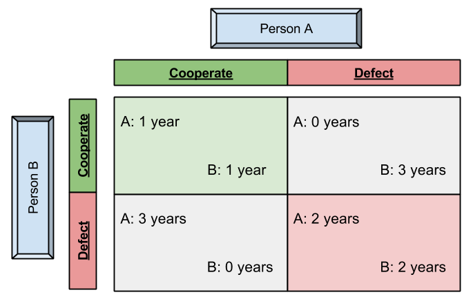
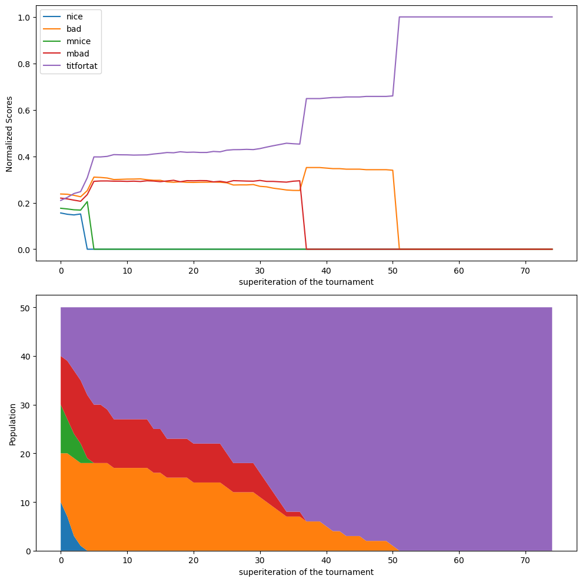

# Iterative Prisoner's Dilemma

## Overview

The Iterative Prisoner's Dilemma project is an in-depth exploration of the classical game theory problem known as the Prisoner's Dilemma (PD). This project models the PD scenario through multiple iterations to analyze how different strategies perform over time in repeated interactions. The project includes basic strategies, advanced strategies, and explores the impact of mutations on these strategies.

### Prisoner's Dilemma (PD)



## Project Structure

The project is structured as follows:

### 1. **Introduction to the Prisoner's Dilemma**
   - The **Prisoner's Dilemma** is introduced as a key concept in game theory. It models the tension between cooperation and self-interest in strategic decision-making.
   - Examples used include:
     - **Trade-off Game**: A situation where two players must decide whether to cooperate by exchanging items or defect by handing over empty bags.
     - **Price Competition**: A business scenario where companies decide whether to lower prices (defect) or maintain high prices (cooperate).

### 2. **Strategies Implemented**
   - The project implements various strategies to explore how they perform in the Iterative Prisoner's Dilemma. These strategies are grouped as follows:

   **Basic Strategies:**
   - `nice`: Always cooperates.
   - `bad`: Always defects.
   - `mnice`: Mostly cooperates but may occasionally defect.
   - `mbad`: Mostly defects but may occasionally cooperate.
   - `titfortat`: Cooperates on the first move, then mimics the opponent's last move.

   **Advanced Strategies:**
   - `forgiving_titfortat`: Similar to TitForTat but occasionally forgives a defection.
   - `suspicious_titfortat`: Starts by defecting but then mimics the opponent's moves.
   - `hard_titfortat`: A stricter version of TitForTat, less forgiving.
   - `pavlov`: Cooperates if the last outcome was positive, defects otherwise.
   - `grudger`: Cooperates until the opponent defects once, then always defects.
   - `hard_joss`: Similar to TitForTat but defects more often to test the opponent.
   - `soft_joss`: A milder version of Hard Joss, defects less frequently.

### Strategy Implementations
Here are the Python functions that define each strategy:

```python
# function of nice guy strategy
def s_niceguy(u_1h = None, u_2h = None):
    return u_c

# function of bad guy strategy
def s_badguy(u_1h = None, u_2h = None):
    return u_d

# function of mainly nice guy strategy
def s_mnice(u_1h = None, u_2h = None):
    a = npr.rand()
    if (a > k/100): 
        return u_c
    else: 
        return u_d

# function of mainly bad guy strategy    
def s_mbad(u_1h = None, u_2h = None):
    a = npr.rand()
    if (a > k/100):
        return u_d
    else: 
        return u_c

# function of Tit_For_Tat strategy
def s_titfortat(u_1h, u_2h):
    if (len(u_1h) == 0):
        return u_c
    else:
        return u_2h[-1]

# function of Random strategy    
def s_random(u_1h, u_2h):
    a = npr.rand()
    if (a < 0.5):
        return u_c
    else:
        return u_d

# function of Forgiving Tit_For_Tat strategy
def s_forgiving_titfortat(u_1h, u_2h):
    if (len(u_1h) < 2):
        return u_c
    else:
        if((u_2h[-1] == u_d).all() and (u_2h[-2] == u_d).all()):
            return u_d
        else:
            return u_c

# function of Pavlov strategy        
def s_pavlov(u_1h, u_2h):
    if(len(u_1h) == 0):
        return u_c
    elif((u_1h[-1] == u_2h[-1]).all()):
        return u_c
    else:
        return u_d

# function of Suspicious Tit_For_Tat strategy    
def s_suspicious_titfortat(u_1h, u_2h):
    if (len(u_1h) == 0):
        return u_d
    else:
        return u_2h[-1]

# function of Reversed Tit_For_Tat strategy    
def s_reversed_titfortat(u_1h, u_2h):
    if (len(u_1h) == 0):
        return u_d
    elif((u_2h[-1] == u_d).all()):
        return u_c
    else:
        return u_d

# function of Hard Tit_For_Tat strategy    
def s_hard_titfortat(u_1h, u_2h):
    if(len(u_1h) < 3):
        if(len(u_1h) == 0):
            return u_c
        elif(len(u_1h) == 1):
            return u_2h[-1]
        elif((u_2h[-1] == u_d).all() or (u_2h[-2] == u_d).all()):
            return u_d
        else:
            return u_c
    elif((u_2h[-1] == u_d).all() or (u_2h[-2] == u_d).all() or (u_2h[-3] == u_d).all()):
        return u_d
    else:
        return u_c

# function of Grudger(Grim) strategy
def s_grudger(u_1h, u_2h):
    if(len(u_1h) == 0):
        return u_c
    else:
        if((u_2h == u_d).any()):
            return u_d
        else:
            return u_c

# function of Hard joss strategy    
def s_hard_joss(u_1h, u_2h):
    p = 0.9
    a = npr.rand()
    if (len(u_1h) == 0):
        if a < p :
            return u_c
        else:
            return u_d
    else:
        if (u_2h[-1] == u_c).all():
            if a < p :
                return u_2h[-1]
            else:
                return u_d
        else:
            return u_d

# function of Soft joss strategy     
def s_soft_joss(u_1h, u_2h):
    p = 0.9
    a = npr.rand()
    if (len(u_1h) == 0):
         return u_c
    else:
        if (u_2h[-1] == u_d).all():
            if a < p :
                return u_2h[-1]
            else:
                return u_c
        else:
            return u_c
```

### 3. **Simulations and Results**
   - The project runs multiple iterations of the game to evaluate the performance of each strategy in a round-robin tournament format.
   - **Key Findings**:
     - **Mutations**: Introducing mutations does not significantly favor any particular strategy over the others.
     - **TitForTat Analysis**: While TitForTat is generally a robust strategy, it is shown to be **not** noise-tolerant, meaning it struggles when slight deviations or perturbations occur in the environment.

### 4. **Visual Representations**
   - The project includes several diagrams and charts to illustrate the outcomes of the different strategies and the effects of mutations.
   - Visual aids and others are used to summarize findings and provide insights into the behavior of strategies over time.

### 5. **Conclusion**
   - The Iterative Prisoner's Dilemma reveals the complexity of strategic interactions, showing that while some strategies like TitForTat are generally strong, they may falter under certain conditions, such as in the presence of noise or mutations.

     
### Result



## How to Use This Project

### Steps to Explore the Project:
1. **Understand the Basic Concepts**: Begin with the introduction to grasp the foundational ideas behind the Prisoner's Dilemma.
2. **Review the Strategies**: Familiarize yourself with the strategies implemented, both basic and advanced.
3. **Analyze the Results**: Look at the simulation outcomes and charts to see how different strategies perform.
4. **Consider the Impact of Mutations**: Pay attention to the sections on mutation to understand how small changes can affect strategic success.
5. **Reflect on the Findings**: Use the conclusions to think about the implications for real-world strategy and decision-making.

## Acknowledgments

This project builds on classic concepts in game theory and the contributions of many researchers in the field. Special thanks to those who have explored and developed the strategies used in this analysis.

